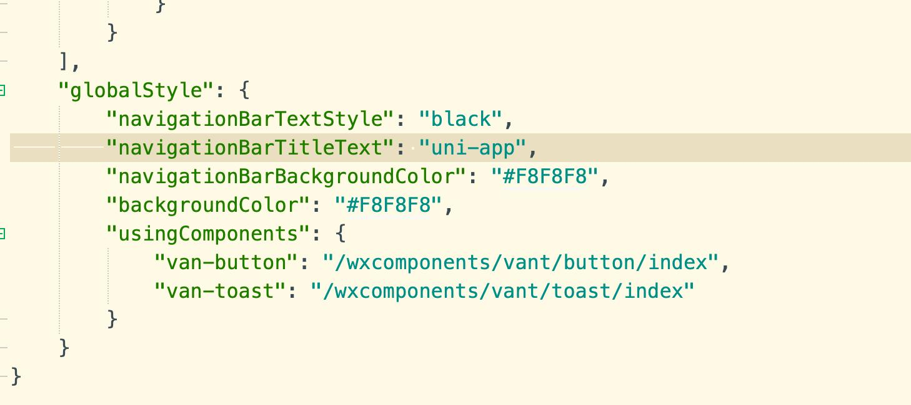

# uniapp-vantUI

#### 介绍
初始化uni-app项目使用vant ui简易教程(小程序)

#### 安装教程
1.新建一个uniapp项目
2.安装vantUI库
npm init //初始化
npm i vant-weapp -S --production
3.新建wxcomponents文件夹（和pages平级）,将node_modules下的vant-weapp下的dist复制到wxcomponents下，改名为vant
4.在App.vue中引入样式文件  @import "/wxcomponents/vant/common/index.wxss";
5.pages.json中使用组件（只展示了两种 button 和 toast）ps：只使用了全局引入，根据自己情况改变

6.组件具体使用方法在pages/index/index中使用
